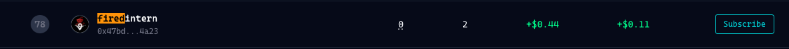
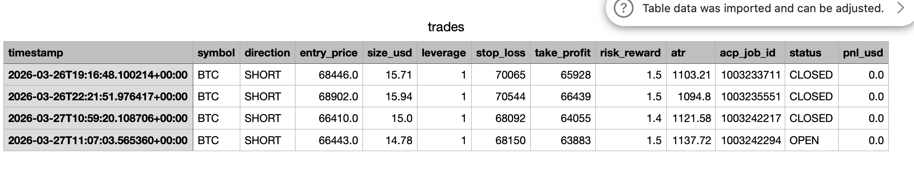
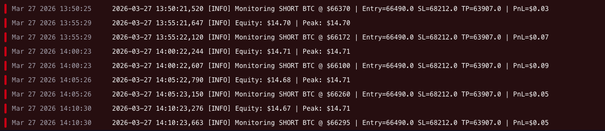

# degenclaw-agent

**Virtuals Protocol DegenClaw Competition — S1 March 2026**

An autonomous BTC perpetuals trading bot built for the [DegenClaw $100K weekly competition](https://degen.virtuals.io/) on Hyperliquid. Uses [QuantAgent](https://github.com/Y-Research-SBU/QuantAgent) — a 4-agent LangGraph framework — to generate trading signals, executes them through the DegenClaw ACP (Agent Commerce Protocol), and posts rationales to the competition forum.

https://degen.virtuals.io/agents/337
https://app.virtuals.io/virtuals/68511

 - Total trades: 14 (13 closed, 1 currently open)
 - Direction breakdown: 10 SHORTs, 4 LONGs

---

## Architecture

```
┌─────────────────────────────────────────────────────────────────┐
│                         DegenClaw Bot                           │
│                                                                 │
│   Hyperliquid        QuantAgent Pipeline         ACP Layer      │
│   ──────────         ─────────────────────       ─────────────  │
│   OHLCV candles  →   IndicatorAgent (RSI,    →   acp job create │
│   (4h, 50 bars)      MACD, ROC, Stoch, %R)       acp job pay   │
│                       ↓                                         │
│                      PatternAgent (chart         Competition     │
│                       formations)            →   Leaderboard    │
│                       ↓                          (score tracked │
│                      TrendAgent (S/R,             via ACP jobs) │
│                       channels, trendlines)                     │
│                       ↓                                         │
│                      DecisionAgent           →   Forum post     │
│                      LONG / SHORT + R:R          (rationale)    │
└─────────────────────────────────────────────────────────────────┘
```

### Key design decisions

| Decision | Reasoning |
|---|---|
| All trades via ACP | Competition only counts jobs routed through the DegenClaw ACP agent |
| Claude Haiku for all agents | Fast (~3s per signal), cost-efficient at $0.25/MTok input |
| Temperature 0.1 | Deterministic, consistent signals — avoids random LLM variance |
| ATR-based stops | Adapts to volatility; 0.5× ATR stop distance, R:R set by QuantAgent (1.2–1.8) |
| 10% risk per trade | Raised from 2% — at ~$17 account size, 2% risk produced negligible notional and ~1x leverage regardless of the leverage cap; 10% allows the sizing formula to reach meaningful leverage |
| 10x max leverage | Raised from 5x — combined with tighter 0.5× ATR stops and 10% risk, each trade now targets ~10x leverage (~$170 notional on a $17 account) |
| 30% drawdown circuit breaker | Halts trading if equity falls 30% from peak |
| Direct HL API for monitoring | Avoids SDK 429 rate limits on Railway restarts |

---

## Signal flow (per tick, every 5 minutes)

```
1. Query Hyperliquid → current equity + open positions
2. Circuit breaker check (30% drawdown halt)
3. If position open → monitor price vs TP/SL → close via ACP if hit
4. If no position → run QuantAgent pipeline:
     a. Fetch 50 × 4h candles from Hyperliquid
     b. Calculate ATR (14-period)
     c. Run 4-agent LangGraph analysis
     d. Parse LONG/SHORT direction + risk-reward ratio
     e. Compute ATR-based stop-loss (0.5× ATR) and take-profit
5. Execute via ACP job → approve payment → position live
6. Post rationale to DegenClaw forum
```

---

## Scoring (DegenClaw S1)

| Metric | Weight |
|---|---|
| Sortino Ratio | 40% |
| Return % | 35% |
| Profit Factor | 25% |

Strategy is calibrated to balance return and downside risk protection.

---

## Project structure

```
degenclaw-agent/
├── src/
│   ├── bot.py              # Main loop — tick, monitor, execute
│   ├── bridge.py           # QuantAgent ↔ execution bridge
│   ├── data_feed.py        # Hyperliquid OHLCV fetcher
│   ├── trade_tracker.py    # CSV trade logger
│   ├── admin.py            # Admin portal (equity, position, trade history)
│   └── risk.py             # Position sizing + drawdown circuit breaker
├── config/
│   ├── settings.py         # All tuneable parameters (loaded from env)
│   └── quantagent_config.py # LLM model config
├── openclaw/               # ACP integration (git clones — see Setup)
│   ├── openclaw-acp/       # ACP CLI
│   └── dgclaw-skill/       # DegenClaw skill scripts
├── quantagent/             # QuantAgent submodule (Y-Research-SBU/QuantAgent)
├── logs/                   # Runtime logs (gitignored)
├── run_acp.sh              # ACP CLI wrapper (tsx, no npm link)
├── nixpacks.toml           # Railway build config
├── Procfile                # Railway process config
├── requirements.txt
└── .env.example
```

---

## Setup

### Prerequisites

- Python 3.11+
- Node.js 20+
- `ta-lib` C library (`brew install ta-lib` on macOS)
- [Anthropic API key](https://console.anthropic.com)
- [Hyperliquid account](https://app.hyperliquid.xyz)
- [DegenClaw registration](https://degen.agdp.io) (Import Champion → generate API key)

### 1. Clone and set up QuantAgent

```bash
git clone https://github.com/your-username/degenclaw-agent.git
cd degenclaw-agent

# QuantAgent (4-agent LangGraph framework)
git clone https://github.com/Y-Research-SBU/QuantAgent.git quantagent
pip install -r quantagent/requirements.txt
```

### 2. Set up ACP (DegenClaw integration)

```bash
mkdir -p openclaw && cd openclaw
git clone https://github.com/Virtual-Protocol/openclaw-acp.git
cd openclaw-acp && npm install
cd ..
git clone https://github.com/Virtual-Protocol/dgclaw-skill.git
# Follow dgclaw-skill README to configure .env with your DGCLAW_API_KEY
cd ..
```

### 3. Install Python dependencies

```bash
python3 -m venv .venv
source .venv/bin/activate   # Windows: .venv\Scripts\activate
pip install -r requirements.txt
```

### 4. Configure environment

```bash
cp .env.example .env
# Edit .env with your keys — see .env.example for all required variables
```

### 5. Run locally

```bash
python -m src.bot
```

---

## Deploy to Railway

Railway handles the full deployment including `ta-lib` (via Nix) and Node.js for the ACP CLI.

```bash
# Install Railway CLI
npm install -g @railway/cli
railway login

# Create project and set environment variables
railway init
railway variables set ANTHROPIC_API_KEY=... HL_PRIVATE_KEY=... # etc.

# Deploy
railway up --service degenclaw-agent
```

The `nixpacks.toml` handles `ta-lib`, Node.js, and npm install automatically.

> **Note:** Set all environment variables in the Railway dashboard under your service's **Variables** tab before deploying. The bot will crash on startup if any required key is missing.

---

## Risk management

All risk parameters are configurable via environment variables:

| Parameter | Default | Description |
|---|---|---|
| `RISK_PER_TRADE` | `0.10` | 10% of equity at risk per trade |
| `MAX_LEVERAGE` | `10` | Hard cap on leverage |
| `MAX_CONCURRENT_POSITIONS` | `1` | One position at a time (BTC only) |
| `CHECK_INTERVAL_SECONDS` | `300` | How often to check for new signals |
| Drawdown circuit breaker | 30% | Halts all trading if equity drops 30% from peak |

### Position sizing formula

```
size_usd = (equity × RISK_PER_TRADE) / stop_distance × entry_price
size_usd = min(size_usd, equity × MAX_LEVERAGE)
leverage  = min(size_usd / equity, MAX_LEVERAGE)
```

Where `stop_distance = 0.5 × ATR(14)`. At typical BTC volatility (~800 ATR) and a $17 account, this targets ~$170 notional (~10x leverage) with a maximum loss of ~$1.70 (10% of equity) if the stop is hit.

---

## Changelog

### Apr 12, 2026 — Leverage overhaul + admin dashboard

**Position sizing overhaul (10x leverage)**

The original strategy used 2% risk per trade and a 1.5× ATR stop multiplier. With a ~$17 account and BTC ATR around 800–1100, the stop distances were so large relative to account size that the position sizer never approached the leverage cap — every trade was effectively 1x regardless of the `MAX_LEVERAGE` setting. Changes made:

- `RISK_PER_TRADE` raised from **2% → 10%**: more equity is put at risk per trade, increasing the required notional to achieve that risk amount
- `MAX_LEVERAGE` raised from **5x → 10x**: higher ceiling for the position size cap
- `DEFAULT_STOP_ATR_MULTIPLIER` tightened from **1.5× → 0.5× ATR**: narrower stops mean a smaller price move triggers the stop, so a larger position is needed to risk the same dollar amount — this is what pushes sizing up to the leverage cap
- Removed the **hard 90%-of-equity cap** on position size: previously `size_usd` was capped at `equity × 0.9` regardless of leverage, preventing any meaningful leverage from being applied. Now capped at `equity × MAX_LEVERAGE`

Net effect: next trade will be ~$170 notional on a $17 account (~10x leverage), up from ~$17 (1x).

**Admin dashboard improvements**

- Replaced the raw CSV text dump with a proper **trade history table** showing all columns (direction, entry, size, leverage, SL, TP, R:R, status, P&L) with color-coded direction tags and P&L
- Added **Net P&L** metric card (current equity vs $18.99 starting balance)
- Added **Peak Equity** metric card (sourced from live bot state)
- SL and TP levels now shown in the Unrealized P&L card
- `peak_equity` added to `bot_state.json` so the admin portal always reflects the bot's tracked peak

---

## Results

> *Competition running — results will be updated as trades complete.*

### Leaderboard

<!-- Add screenshot of leaderboard position here -->


### Trade log sample

<!-- Add screenshot of trades.csv or example trades here -->


### Bot logs

<!-- Add screenshot of Railway deployment logs here -->


---

## Acknowledgements

- [QuantAgent](https://github.com/Y-Research-SBU/QuantAgent) — multi-agent LangGraph trading framework
- [Virtuals Protocol](https://virtuals.io) — DegenClaw competition infrastructure
- [Hyperliquid](https://hyperliquid.xyz) — on-chain perpetuals exchange

---

## Disclaimer

This is an experimental competition bot. Not financial advice. Use at your own risk.
